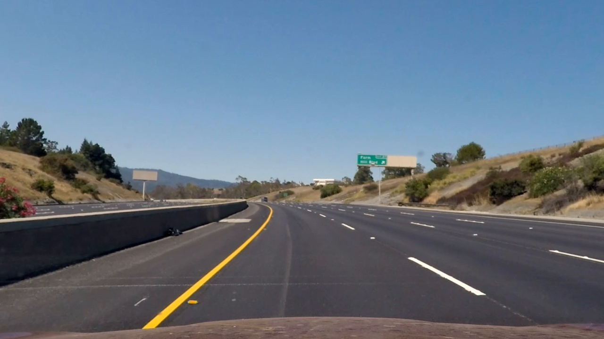

## Writeup

---

**Advanced Lane Finding Project**

The goals of this project were the following:

* Compute the camera calibration matrix and distortion coefficients given a set of chessboard images.
* Apply a distortion correction to raw images.
* Use color transforms, gradients, etc., to create a thresholded binary image.
* Apply a perspective transform to rectify binary image ("birds-eye view").
* Detect lane pixels and fit to find the lane boundary.
* Determine the curvature of the lane and vehicle position with respect to center.
* Warp the detected lane boundaries back onto the original image.
* Output visual display of the lane boundaries and numerical estimation of lane curvature and vehicle position.

## [Rubric](https://review.udacity.com/#!/rubrics/571/view) Points

### Here I will consider the rubric points individually and describe how I addressed each point in my implementation.  

---

### Camera Calibration

#### 1. Briefly state how you computed the camera matrix and distortion coefficients. Provide an example of a distortion corrected calibration image.

The camera calibration consisted of defining `image points` and `object points` so that we can link points on the image to points on the real-world object.

This process consisted of three main steps:

- reading the original image into an array  
- converting it to grayscale
- applying the `cv2.findChessboardCorners` function on it with the appropriate NX and NY parameters (9, 6)

These steps were done on 20 calibration images which showed a chessboard with 9x6 corners.

After these steps, we have an array of `imgpoints` and `objpoints`. We can use these to calibrate the camera with the help of the `cv2.calibrateCamera` function.
This returns the `camera matrix`, the `distortion coefficient`, `rotational vector` and `transformation vector`. We actually only need the first two for properly calibrating the camera.

Then, we can use `cv2.undistort` along with `camera matrix` and the `distortion coefficient` to undistort an image.

An example of a chessboard image and the recognized corners:


An example of an undistorted calibration image:


### Pipeline (single images)

#### 1. An example of a distortion-corrected image.

An example of a distorted (original) test image, and an undistorted version can be seen below.





#### 2. Using color transforms, gradients or other methods to create a thresholded binary image.

I used a combination of color and gradient thresholds to generate a binary image (thresholding steps at lines `#170` through `#212` in `color_thresholds.py`).  Here's an example of my output for this step.


The pipeline I used used various thresholds in the RGB and HLS color space along with a threhold for the direction and magnitude of the gradient. Most importantly I tried to identify pixels belonging to the lane lines, which are either yellow or white-ish. I also defined pixel ranges that should be excluded from the thresholded image. I did this so that the dark grey line in the challenge video (some kind of oil spill or road imperfection) is not mistaken for a lane line.

I also used a region masked on the thresholded image to filter out everything that's not the road:


#### 3. Describe how (and identify where in your code) you performed a perspective transform and provide an example of a transformed image.

The code for my perspective transform includes a function called `unwarp_image()`, which appears in lines 26 through 33 in the file `perspective.py`.  The `unwarp_image()` function takes as inputs an image (`img`), as well as source (`src`) and destination (`dst`) points.  I chose the hardcode the source and destination points in the following manner:

```python
src = np.float32([(574,473),
                  (753,472),
                  (368,629),
                  (1039,653)])
dst = np.float32([(450,0),
                  (w-240,0),
                  (450,h-55),
                  (w-240,h-25)])
```

This resulted in the following source and destination points:


| Source        | Destination   |
|:-------------:|:-------------:|
| 574, 473      | 450, 0        |
| 368, 629      | 450, 685      |
| 1039, 653     | 1040, 685      |
| 753, 472      | 1040, 0        |


An example of a perspective-transformed image can be seen below:


#### 4. Identifying lane-line pixels and fitting a polynomial on them

I used the sliding-window method to identify lane-line pixels on the image, and then I fitted a polynomial function on the points to have a continuous line. The code for this can be found in the `sliding_window.py` file. The sliding window search was based on the histogram obtained from the pixels of the lower half of the perspective-transformed binary image. Such a histogram is shown here:


Notice how the right lane line is very faint, but the left peak is strong - it is probably taken from an image where the right lane line is hardly visible, and the left line can be nicely seen.


#### 5. Describe how (and identify where in your code) you calculated the radius of curvature of the lane and the position of the vehicle with respect to center.

I did this in lines 3 through 17 in my code in `curvature.py` by using a very simple function to print the estimated lane curvature to the standard output. This function is used in the `sliding window` script, so that when the video is generated, the estimated curvature is printed out.

The resulting lane curvatures are about `700m` and above, with most values being around `1200-1300m` which seem to be in the correct order of magnitude. On some nearly straight stretches of road, the lane curvature can be one or even two orders of magnitude larger, but this is expected, since in theory a straight line has no curvature (segment of a circle with an infinite radius).

The distance from the center of the lane was calculated in the same function. This was done by getting the X-intercepts of the estimated lane lines (this would be the center of the lane) and calculating its distance from the camera (which is halfway through the X axis), then converting the pixel values to meters.

On the test image below, I got the following results:

- left lane line radius: `876.388163195 m`  
- right lane line radius: `719.768121785 m`   
- offset from the center: `-0.580857142857 m`


#### 6. Provide an example image of your result plotted back down onto the road such that the lane area is identified clearly.

I implemented this step in lines # through # in my code in `sliding_window.py` in the `__main__` section of the script, so when it is evoked, it runs through the pipeline using one image as an example.  Here is an example of my result on a test image:

![alt text][output_images/result.jpg]

---

### Pipeline (video)

#### 1. The final video output

Here's a [link to my video result](./project_video.mp4).

---

### Discussion

#### 1. Discussion, problems, improvement areas

My submission utilizes the sliding window method with
